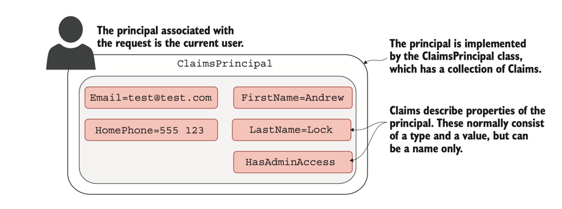

# Authentication and Authorization

### Authentication
The process of creating users and letting them log in to your app, which determines _who you are_

### Authorization
The process of determining _what you’re allowed to do_, Customizing the experience and controlling what users can do, based on the current logged-in user
**Authentication always comes first, followed by authorization**

### Users and claims in ASP.NET Core
Whenever a new request comes in Kestrel (HTTP Server in ASP.NET Core) creates an HttpContext object. This object is responsible for storing all the details related to that request, such as the request URL, any headers sent, the body of the request, and so on.
The HttpContext object also exposes the current principal for a request as the User property. This is ASP.NET Core’s view of which user made the request. Any time your app needs to know who the current user is, or what they’re allowed to do, it can look at the HttpContext.User principal
> You can think of the principal as the user of your app.
> 
> 